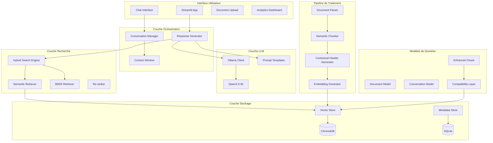
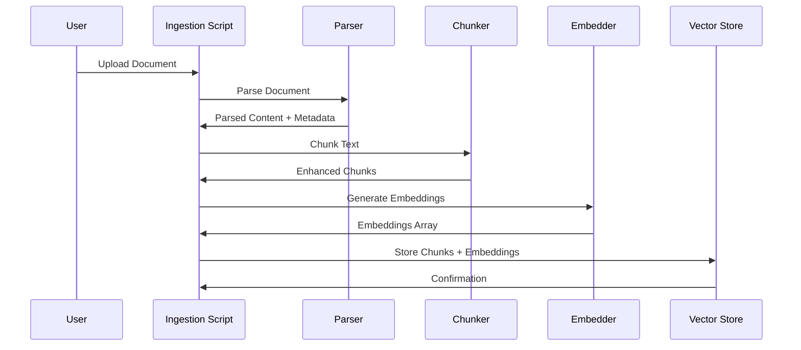
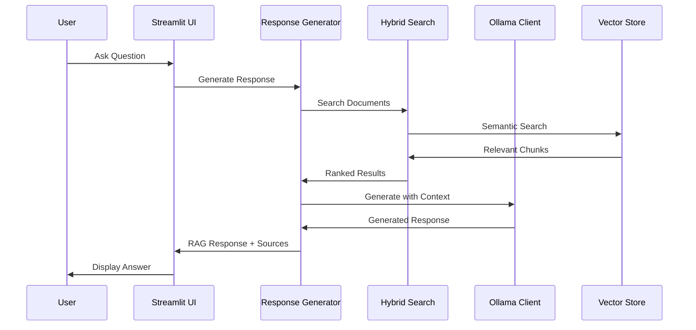

# 🏗️ Architecture Technique - Assistant RAG INPT

## Vue d'Ensemble de l'Architecture

L'Assistant RAG INPT est conçu selon une architecture modulaire et extensible qui sépare clairement les responsabilités entre les différentes couches du système.

## 📊 Diagramme d'Architecture Détaillé



## 🔧 Composants Détaillés

### 1. Interface Utilisateur (`app/`)

#### Application Principale (`chat.py`)
```python
# Architecture de l'interface Streamlit
class StreamlitApp:
    - initialize_system()      # Cache des composants système
    - render_sidebar()         # Interface de navigation
    - render_main_chat()       # Chat conversationnel
    - render_sources()         # Affichage des sources avec compatibilité
```

**Fonctionnalités Clés :**
- Cache Streamlit pour performance (`@st.cache_resource`)
- Gestion d'état de session persistante
- Rendu mathématique LaTeX intégré
- Support de compatibilité pour formats de chunks mixtes

#### Composants Réutilisables (`components/`)
```python
# Interface de chat modulaire
class ChatInterface:
    - render_message()         # Affichage de messages
    - render_sources()         # Sources avec métadonnées enrichies
    - render_enhanced_sources() # Support format nouveau/ancien
```

### 2. Couche Orchestration (`src/llm/`)

#### Générateur de Réponses (`response_generator.py`)
```python
class ResponseGenerator:
    - generate_response()           # Pipeline RAG complet
    - _is_follow_up_question()     # Détection intelligente de suivi
    - _filter_by_confidence()      # Filtrage par score
    - _calculate_confidence()      # Calcul de confiance globale
```

**Algorithme de Détection de Questions de Suivi :**
```python
def _is_follow_up_question(question, history):
    # 1. Patterns linguistiques (pronoms, références)
    follow_up_patterns = [
        r'\b(cela|ça|ce|cette|cet|ces)\b',
        r'^(il|elle|ils|elles|le|la|les)\b',
        r'^(et|mais|donc|alors|aussi)\b'
    ]
    
    # 2. Analyse des mots-clés communs
    # 3. Validation de questions complètes
    return is_follow_up
```

### 3. Couche Recherche (`src/retrieval/`)

#### Moteur de Recherche Hybride (`hybrid_search.py`)
```python
class HybridSearchEngine:
    - search()                 # Recherche hybride principale
    - _semantic_search()       # Recherche vectorielle
    - _bm25_search()          # Recherche par mots-clés
    - _fuse_results()         # Fusion pondérée des scores
```

**Algorithme de Fusion :**
```python
def _fuse_results(semantic_results, bm25_results):
    # Normalisation des scores
    if normalize_scores:
        semantic_results = normalize_scores(semantic_results)
        bm25_results = normalize_scores(bm25_results)
    
    # Fusion pondérée
    for result in results_dict.values():
        result.score = (
            result.semantic_score * semantic_weight +
            result.bm25_score * bm25_weight
        )
    
    return sorted(results_dict.values(), key=lambda x: x.score, reverse=True)
```

### 4. Pipeline de Traitement (`src/document_processing/`)

#### Parser de Documents (`parser.py`)
```python
class DocumentParser:
    SUPPORTED_FORMATS = {'.pdf', '.txt', '.md', '.docx'}
    
    - parse()              # Parser universel
    - _parse_pdf()         # Extraction PDF avec pages
    - _parse_txt()         # Texte avec détection encodage
    - _parse_markdown()    # MD vers HTML vers texte
    - _parse_docx()        # DOCX avec métadonnées
```

#### Chunker Sémantique (`chunker.py`)
```python
class SemanticChunker:
    - chunk_text()                    # Chunking standard
    - chunk_with_pages()             # Chunking avec structure pages
    - _create_enhanced_chunk()       # Création chunks enrichis
    - _generate_contextual_header()  # En-têtes contextuels
```

**Algorithme de Chunking :**
```python
def chunk_text(text, preserve_structure=True):
    # 1. Détection de structure (titres, sections)
    # 2. Découpage respectant les limites sémantiques
    # 3. Génération d'en-têtes contextuels
    # 4. Création de métadonnées enrichies
    
    for chunk in chunks:
        enhanced_chunk = EnhancedChunk(
            content=chunk_text,
            contextual_header=generate_header(chunk, context),
            hierarchy_path=extract_hierarchy(chunk),
            structure_metadata=analyze_structure(chunk)
        )
```

### 5. Couche Stockage (`src/storage/`)

#### Vector Store (`vector_store.py`)
```python
class VectorStore:
    - add_documents()      # Ajout avec embeddings
    - search()            # Recherche vectorielle
    - get_by_ids()        # Récupération par ID
    - update_metadata()   # Mise à jour métadonnées
    - count()             # Statistiques
```

#### Modèles de Données (`models.py`)
```python
@dataclass
class EnhancedChunk(Chunk):
    contextual_header: str
    hierarchy_path: List[str]
    structure_metadata: Dict[str, Any]
    
    def to_storage_metadata(self) -> Dict[str, Any]:
        # Sérialisation pour ChromaDB
        
    @classmethod
    def from_storage_metadata(cls, ...):
        # Désérialisation depuis ChromaDB
```

#### Couche de Compatibilité (`compatibility.py`)
```python
class CompatibilityLayer:
    - normalize_search_results()   # Normalisation des résultats
    - migrate_chunk_format()       # Migration de format
    - detect_chunk_format()        # Détection de format
    - ensure_backward_compatibility() # Compatibilité ascendante
```

### 6. Intégration LLM (`src/llm/`)

#### Client Ollama (`ollama_client.py`)
```python
class OllamaClient:
    - generate()              # Génération de texte
    - _check_connection()     # Vérification connectivité
    - _handle_timeout()       # Gestion des timeouts
    - _retry_on_failure()     # Retry automatique
```

#### Templates de Prompts (`prompt_templates.py`)
```python
class PromptBuilder:
    - build_rag_prompt()           # Prompt RAG standard
    - build_conversation_prompt()  # Prompt conversationnel
    - build_follow_up_prompt()     # Questions de suivi
```

## 🔄 Flux de Données

### 1. Ingestion de Documents



### 2. Génération de Réponse



## 🏛️ Patterns Architecturaux

### 1. Repository Pattern
```python
# Abstraction de la couche de stockage
class VectorStoreInterface:
    def add_documents(self, ...): pass
    def search(self, ...): pass
    def get_by_ids(self, ...): pass

class ChromaDBVectorStore(VectorStoreInterface):
    # Implémentation ChromaDB
```

### 2. Strategy Pattern
```python
# Stratégies de recherche interchangeables
class SearchStrategy:
    def search(self, query): pass

class SemanticSearchStrategy(SearchStrategy):
    def search(self, query): # Recherche vectorielle

class BM25SearchStrategy(SearchStrategy):
    def search(self, query): # Recherche par mots-clés

class HybridSearchStrategy(SearchStrategy):
    def search(self, query): # Combinaison des deux
```

### 3. Factory Pattern
```python
# Factory pour parsers de documents
class DocumentParserFactory:
    @staticmethod
    def create_parser(file_extension):
        parsers = {
            '.pdf': PDFParser,
            '.txt': TextParser,
            '.md': MarkdownParser,
            '.docx': DocxParser
        }
        return parsers[file_extension]()
```

### 4. Observer Pattern
```python
# Système d'événements pour analytics
class AnalyticsTracker:
    def __init__(self):
        self.observers = []
    
    def notify(self, event):
        for observer in self.observers:
            observer.handle_event(event)
```

## 🔧 Configuration et Paramétrage

### Configuration Centralisée (`src/config/settings.py`)
```python
class Settings(BaseSettings):
    # Validation automatique avec Pydantic
    # Variables d'environnement
    # Valeurs par défaut
    # Validation des types et contraintes
    
    @field_validator('OLLAMA_BASE_URL')
    def validate_ollama_url(cls, v):
        # Validation personnalisée
```

### Gestion d'Environnement
```python
def validate_environment_configuration():
    # Détection Docker vs Local
    # Validation des chemins
    # Vérification des services
    # Configuration adaptative
```

## 🚀 Optimisations de Performance

### 1. Cache Multi-Niveau
```python
# Cache Streamlit pour composants lourds
@st.cache_resource
def initialize_system():
    return heavy_initialization()

# Cache applicatif pour embeddings
class EmbeddingCache:
    def __init__(self, ttl=3600):
        self.cache = {}
        self.ttl = ttl
```

### 2. Traitement par Batch
```python
class EmbeddingGenerator:
    def generate_embeddings_batch(self, texts, batch_size=32):
        # Traitement optimisé par lots
        for i in range(0, len(texts), batch_size):
            batch = texts[i:i+batch_size]
            yield self.model.encode(batch)
```

### 3. Lazy Loading
```python
class ModelManager:
    def __init__(self):
        self._model = None
    
    @property
    def model(self):
        if self._model is None:
            self._model = self._load_model()
        return self._model
```

## 🔒 Sécurité et Robustesse

### 1. Validation des Entrées
```python
class InputValidator:
    @staticmethod
    def validate_query(query: str) -> str:
        # Nettoyage et validation
        # Protection contre injection
        # Limitation de taille
        return sanitized_query
```

### 2. Gestion d'Erreurs
```python
class ErrorHandler:
    def __init__(self):
        self.logger = logger
    
    def handle_llm_error(self, error):
        # Retry automatique
        # Fallback gracieux
        # Logging détaillé
```

### 3. Monitoring et Observabilité
```python
class SystemMonitor:
    def track_performance(self, operation, duration):
        # Métriques de performance
        # Alertes automatiques
        # Logs structurés
```

## 🔄 Extensibilité et Maintenance

### 1. Plugin Architecture
```python
# Interface pour nouveaux composants
class ProcessorPlugin:
    def process(self, data): pass
    def get_metadata(self): pass

# Enregistrement dynamique
class PluginManager:
    def register_plugin(self, plugin_class):
        self.plugins.append(plugin_class())
```

### 2. Migration de Données
```python
class DataMigrator:
    def migrate_chunks_to_v2(self):
        # Migration transparente
        # Validation de données
        # Rollback en cas d'erreur
```

### 3. Tests d'Intégration
```python
class SystemIntegrationTest:
    def test_end_to_end_pipeline(self):
        # Test complet du pipeline
        # Validation des performances
        # Vérification de la qualité
```

## 📊 Métriques et Monitoring

### Métriques Système
- **Latence** : Temps de réponse par composant
- **Throughput** : Documents traités par minute
- **Précision** : Qualité des résultats de recherche
- **Disponibilité** : Uptime des services

### Métriques Métier
- **Satisfaction Utilisateur** : Feedback sur les réponses
- **Couverture** : Pourcentage de questions avec réponses
- **Engagement** : Utilisation des fonctionnalités
- **Performance Éducative** : Impact sur l'apprentissage

Cette architecture modulaire et extensible permet une maintenance facile, des performances optimales et une évolution continue du système selon les besoins éducatifs de l'INPT Smart ICT.