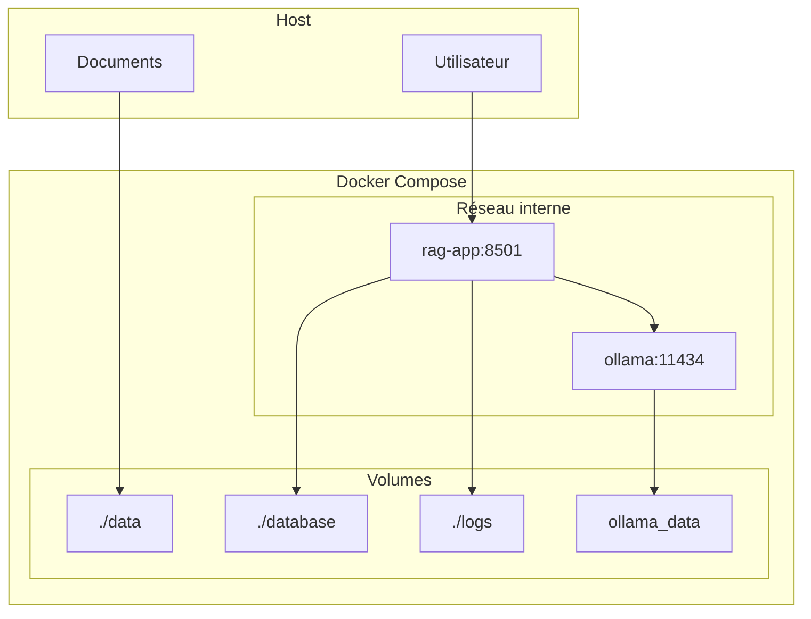

# 🐳 Guide Docker - Assistant RAG INPT

## Vue d'Ensemble

Ce guide détaille l'utilisation de Docker pour déployer l'Assistant RAG INPT dans différents environnements. La configuration Docker inclut tous les services nécessaires : application Streamlit, Ollama pour les LLMs, et la persistance des données.

## 📋 Architecture Docker

### Services Inclus

```yaml
services:
  ollama:          # Service LLM local
  rag-app:         # Application Streamlit principale
  
volumes:
  ollama_data:     # Persistance des modèles Ollama
  # + volumes montés pour données, base, logs
```

### Diagramme des Services



## 🚀 Démarrage Rapide

### 1. Prérequis

```bash
# Vérifier Docker et Docker Compose
docker --version          # >= 20.10
docker-compose --version  # >= 2.0

# Vérifier les ressources disponibles
docker system df
free -h  # Au moins 8GB RAM recommandé
```

### 2. Lancement Simple

```bash
# Aller dans le répertoire Docker
cd docker

# Lancer tous les services
docker-compose up -d

# Vérifier l'état
docker-compose ps
```

### 3. Accès aux Services

- **Application** : http://localhost:8501
- **Ollama API** : http://localhost:11434
- **Logs** : `docker-compose logs -f`

## 🔧 Configuration Détaillée

### 1. Structure des Fichiers

```
docker/
├── Dockerfile                    # Image de l'application
├── docker-compose.yml           # Configuration développement
├── docker-compose.prod.yml      # Configuration production
├── docker-compose.dev.yml       # Configuration développement avancée
├── entrypoint.sh                # Script d'initialisation
├── docker-health-check.sh       # Vérification de santé
├── docker-run.sh               # Script de déploiement rapide
└── nginx.conf                  # Configuration Nginx (prod)
```

### 2. Dockerfile Optimisé

```dockerfile
# Multi-stage build pour optimisation
FROM python:3.11-slim

# Variables d'environnement optimisées
ENV PYTHONUNBUFFERED=1 \
    PYTHONDONTWRITEBYTECODE=1 \
    PIP_NO_CACHE_DIR=1

# Installation des dépendances système
RUN apt-get update && apt-get install -y --no-install-recommends \
    build-essential curl git poppler-utils tesseract-ocr \
    && rm -rf /var/lib/apt/lists/*

# Installation Python avec cache optimisé
COPY requirements.txt .
RUN pip install --upgrade pip && \
    pip install --no-cache-dir -r requirements.txt

# Téléchargement des données NLTK
RUN python -c "import nltk; nltk.download('punkt', quiet=True)"

# Configuration de l'application
WORKDIR /app
COPY src/ ./src/
COPY app/ ./app/
COPY scripts/ ./scripts/

# Health check intégré
HEALTHCHECK --interval=30s --timeout=10s --start-period=30s --retries=3 \
    CMD curl -f http://localhost:8501/_stcore/health || exit 1

# Point d'entrée avec initialisation
COPY docker/entrypoint.sh /entrypoint.sh
RUN chmod +x /entrypoint.sh

ENTRYPOINT ["/entrypoint.sh"]
CMD ["streamlit", "run", "app/chat.py", "--server.port=8501", "--server.address=0.0.0.0"]
```

### 3. Configuration Docker Compose

#### Développement (`docker-compose.yml`)

```yaml
version: '3.8'

services:
  # Service Ollama pour LLM
  ollama:
    image: ollama/ollama:latest
    container_name: inpt-ollama
    ports:
      - "11434:11434"
    volumes:
      - ollama_data:/root/.ollama
    environment:
      - OLLAMA_MODELS=/root/.ollama/models
      - OLLAMA_NUM_PARALLEL=2
      - OLLAMA_MAX_LOADED_MODELS=1
    restart: unless-stopped
    healthcheck:
      test: ["CMD", "curl", "-f", "http://localhost:11434/api/tags"]
      interval: 30s
      timeout: 10s
      retries: 3

  # Application RAG principale
  rag-app:
    build:
      context: ..
      dockerfile: docker/Dockerfile
    container_name: inpt-rag-app
    ports:
      - "8501:8501"
    volumes:
      - ../data:/app/data
      - ../database:/app/database
      - ../logs:/app/logs
    environment:
      # Configuration adaptée pour Docker
      - OLLAMA_BASE_URL=http://ollama:11434
      - OLLAMA_MODEL=qwen2.5:3b
      - BASE_DIR=/app
      - DATA_DIR=/app/data
      - DATABASE_DIR=/app/database
      - LOGS_DIR=/app/logs
      - PYTHONUNBUFFERED=1
    depends_on:
      ollama:
        condition: service_healthy
    restart: unless-stopped
    healthcheck:
      test: ["CMD", "curl", "-f", "http://localhost:8501/_stcore/health"]
      interval: 30s
      timeout: 10s
      retries: 3

volumes:
  ollama_data:
    driver: local
```

#### Production (`docker-compose.prod.yml`)

```yaml
version: '3.8'

services:
  # Nginx reverse proxy
  nginx:
    image: nginx:alpine
    container_name: inpt-nginx
    ports:
      - "80:80"
      - "443:443"
    volumes:
      - ./nginx.conf:/etc/nginx/nginx.conf:ro
      - ./ssl:/etc/nginx/ssl:ro
    depends_on:
      - rag-app
    restart: unless-stopped

  # Configuration production pour l'app
  rag-app:
    extends:
      file: docker-compose.yml
      service: rag-app
    environment:
      # Optimisations production
      - STREAMLIT_SERVER_HEADLESS=true
      - STREAMLIT_SERVER_ENABLE_CORS=false
      - STREAMLIT_SERVER_ENABLE_XSRF_PROTECTION=true
      - STREAMLIT_SERVER_MAX_UPLOAD_SIZE=200
      - LOG_LEVEL=INFO
      - CACHE_TTL=7200
    deploy:
      resources:
        limits:
          memory: 8G
          cpus: '4'
        reservations:
          memory: 4G
          cpus: '2'
```

## 🔄 Script d'Initialisation (entrypoint.sh)

### Fonctionnalités du Script

```bash
#!/bin/bash
set -e

# Fonctions de logging
log_info() { echo "$(date '+%Y-%m-%d %H:%M:%S') [INFO] $1"; }
log_error() { echo "$(date '+%Y-%m-%d %H:%M:%S') [ERROR] $1" >&2; }
log_success() { echo "$(date '+%Y-%m-%d %H:%M:%S') [SUCCESS] $1"; }

# 1. Validation de la configuration
validate_configuration() {
    log_info "🔍 Validating configuration..."
    
    # Vérifier les variables requises
    required_vars=("OLLAMA_BASE_URL" "OLLAMA_MODEL" "PROJECT_NAME")
    for var in "${required_vars[@]}"; do
        if [ -z "${!var}" ]; then
            log_error "Missing required variable: $var"
            exit 1
        fi
    done
}

# 2. Attente d'Ollama avec retry exponentiel
wait_for_ollama() {
    log_info "⏳ Waiting for Ollama service..."
    
    local max_retries=30
    local counter=0
    local backoff=1
    
    while ! curl -s --connect-timeout 5 "$OLLAMA_BASE_URL/api/tags" > /dev/null; do
        counter=$((counter + 1))
        if [ $counter -gt $max_retries ]; then
            log_error "Failed to connect to Ollama after $max_retries attempts"
            exit 1
        fi
        
        log_info "Attempt $counter/$max_retries - waiting ${backoff}s..."
        sleep $backoff
        backoff=$((backoff < 8 ? backoff * 2 : 8))
    done
    
    log_success "Ollama service is ready!"
}

# 3. Gestion des modèles avec téléchargement automatique
manage_ollama_model() {
    log_info "🔍 Checking LLM model availability..."
    
    # Vérifier si le modèle existe
    if curl -s "$OLLAMA_BASE_URL/api/tags" | grep -q "\"name\":\"$OLLAMA_MODEL\""; then
        log_success "Model $OLLAMA_MODEL is available"
        return 0
    fi
    
    log_info "📥 Downloading model $OLLAMA_MODEL (this may take several minutes)..."
    
    # Télécharger le modèle
    curl -s -X POST "$OLLAMA_BASE_URL/api/pull" \
        -H "Content-Type: application/json" \
        -d "{\"name\": \"$OLLAMA_MODEL\"}"
    
    # Attendre que le téléchargement soit terminé
    local wait_counter=0
    while [ $wait_counter -lt 60 ]; do
        if curl -s "$OLLAMA_BASE_URL/api/tags" | grep -q "\"name\":\"$OLLAMA_MODEL\""; then
            log_success "Model $OLLAMA_MODEL downloaded successfully!"
            return 0
        fi
        wait_counter=$((wait_counter + 1))
        sleep 10
    done
    
    log_error "Model download timeout"
    exit 1
}

# 4. Initialisation des répertoires
initialize_directories() {
    log_info "📁 Initializing directories..."
    
    python3 -c "
from src.config.settings import setup_directories
setup_directories()
print('Directories initialized successfully')
" || {
        log_error "Failed to initialize directories"
        exit 1
    }
}

# 5. Validation de l'état de l'application
validate_application_state() {
    log_info "🔍 Validating application state..."
    
    # Vérifier ChromaDB
    if [ ! -d "/app/database/chroma_db" ]; then
        mkdir -p "/app/database/chroma_db"
    fi
    
    # Vérifier les dépendances Python
    python3 -c "
import streamlit, chromadb, sentence_transformers
print('All dependencies available')
" || {
        log_error "Missing Python dependencies"
        exit 1
    }
}

# Fonction principale
main() {
    log_info "🚀 Starting INPT RAG Assistant initialization..."
    
    validate_configuration
    wait_for_ollama
    manage_ollama_model
    initialize_directories
    validate_application_state
    
    log_success "✅ System initialization completed!"
    log_info "🚀 Starting application..."
    
    # Exécuter la commande principale
    exec "$@"
}

main "$@"
```

## 📊 Gestion des Données

### 1. Volumes et Persistance

```yaml
# Configuration des volumes
volumes:
  # Volume nommé pour modèles Ollama
  ollama_data:
    driver: local
    
  # Volumes montés pour données applicatives
  - ../data:/app/data                    # Documents et conversations
  - ../database:/app/database            # ChromaDB et SQLite
  - ../logs:/app/logs                    # Logs applicatifs
```

### 2. Sauvegarde des Données

```bash
# Script de sauvegarde Docker
#!/bin/bash
BACKUP_DIR="./backups/$(date +%Y%m%d_%H%M%S)"
mkdir -p $BACKUP_DIR

# Sauvegarder les volumes
docker run --rm -v inpt-rag_ollama_data:/data -v $PWD/$BACKUP_DIR:/backup \
    alpine tar czf /backup/ollama_models.tar.gz -C /data .

# Sauvegarder les données montées
tar czf $BACKUP_DIR/application_data.tar.gz data/ database/ logs/

echo "Backup completed in $BACKUP_DIR"
```

### 3. Restauration des Données

```bash
# Restauration depuis sauvegarde
#!/bin/bash
BACKUP_DIR=$1

if [ -z "$BACKUP_DIR" ]; then
    echo "Usage: $0 <backup_directory>"
    exit 1
fi

# Arrêter les services
docker-compose down

# Restaurer les volumes
docker run --rm -v inpt-rag_ollama_data:/data -v $PWD/$BACKUP_DIR:/backup \
    alpine tar xzf /backup/ollama_models.tar.gz -C /data

# Restaurer les données montées
tar xzf $BACKUP_DIR/application_data.tar.gz

# Redémarrer les services
docker-compose up -d
```

## 🔧 Commandes Utiles

### 1. Gestion des Services

```bash
# Démarrage et arrêt
docker-compose up -d              # Démarrer en arrière-plan
docker-compose down               # Arrêter tous les services
docker-compose restart rag-app   # Redémarrer un service

# Monitoring
docker-compose ps                 # État des services
docker-compose logs -f rag-app   # Logs en temps réel
docker-compose top               # Processus en cours
```

### 2. Maintenance

```bash
# Mise à jour des images
docker-compose pull
docker-compose up -d --force-recreate

# Nettoyage
docker-compose down -v           # Supprimer volumes
docker system prune -f           # Nettoyer le système
docker volume prune -f           # Nettoyer les volumes orphelins
```

### 3. Debug et Développement

```bash
# Accès shell dans les conteneurs
docker-compose exec rag-app bash
docker-compose exec ollama bash

# Exécution de commandes
docker-compose exec rag-app python scripts/ingest_documents.py --stats
docker-compose exec ollama ollama list

# Reconstruction avec cache
docker-compose build --no-cache rag-app
```

## 🚀 Déploiement Production

### 1. Configuration Nginx

```nginx
# nginx.conf pour production
events {
    worker_connections 1024;
}

http {
    upstream rag_app {
        server rag-app:8501;
    }
    
    server {
        listen 80;
        server_name votre-domaine.com;
        
        # Redirection HTTPS
        return 301 https://$server_name$request_uri;
    }
    
    server {
        listen 443 ssl http2;
        server_name votre-domaine.com;
        
        # Configuration SSL
        ssl_certificate /etc/nginx/ssl/cert.pem;
        ssl_certificate_key /etc/nginx/ssl/key.pem;
        
        # Optimisations SSL
        ssl_protocols TLSv1.2 TLSv1.3;
        ssl_ciphers ECDHE-RSA-AES256-GCM-SHA512:DHE-RSA-AES256-GCM-SHA512;
        ssl_prefer_server_ciphers off;
        
        # Configuration Streamlit
        location / {
            proxy_pass http://rag_app;
            proxy_http_version 1.1;
            proxy_set_header Upgrade $http_upgrade;
            proxy_set_header Connection "upgrade";
            proxy_set_header Host $host;
            proxy_set_header X-Real-IP $remote_addr;
            proxy_set_header X-Forwarded-For $proxy_add_x_forwarded_for;
            proxy_set_header X-Forwarded-Proto $scheme;
            
            # Timeouts pour Streamlit
            proxy_read_timeout 86400;
            proxy_send_timeout 86400;
        }
        
        # Sécurité
        add_header X-Frame-Options DENY;
        add_header X-Content-Type-Options nosniff;
        add_header X-XSS-Protection "1; mode=block";
    }
}
```

### 2. Script de Déploiement

```bash
#!/bin/bash
# deploy.sh - Script de déploiement production

set -e

echo "🚀 Déploiement INPT RAG Assistant"

# Variables
ENVIRONMENT=${1:-production}
BACKUP_BEFORE_DEPLOY=${2:-true}

# Sauvegarde avant déploiement
if [ "$BACKUP_BEFORE_DEPLOY" = "true" ]; then
    echo "📦 Création d'une sauvegarde..."
    ./backup.sh
fi

# Mise à jour du code
echo "📥 Mise à jour du code..."
git pull origin main

# Construction des nouvelles images
echo "🔨 Construction des images..."
docker-compose -f docker-compose.prod.yml build --no-cache

# Déploiement avec zero-downtime
echo "🔄 Déploiement des services..."
docker-compose -f docker-compose.prod.yml up -d

# Vérification de santé
echo "🏥 Vérification de santé..."
sleep 30
./docker-health-check.sh

# Nettoyage
echo "🧹 Nettoyage..."
docker system prune -f

echo "✅ Déploiement terminé avec succès!"
```

### 3. Monitoring et Alertes

```yaml
# docker-compose.monitoring.yml
version: '3.8'

services:
  prometheus:
    image: prom/prometheus:latest
    ports:
      - "9090:9090"
    volumes:
      - ./prometheus.yml:/etc/prometheus/prometheus.yml
      - prometheus_data:/prometheus
    command:
      - '--config.file=/etc/prometheus/prometheus.yml'
      - '--storage.tsdb.path=/prometheus'
      - '--web.console.libraries=/etc/prometheus/console_libraries'
      - '--web.console.templates=/etc/prometheus/consoles'

  grafana:
    image: grafana/grafana:latest
    ports:
      - "3000:3000"
    environment:
      - GF_SECURITY_ADMIN_PASSWORD=admin
    volumes:
      - grafana_data:/var/lib/grafana
      - ./grafana/dashboards:/etc/grafana/provisioning/dashboards
      - ./grafana/datasources:/etc/grafana/provisioning/datasources

volumes:
  prometheus_data:
  grafana_data:
```

## 🔍 Dépannage Docker

### Problèmes Courants

#### Services qui ne démarrent pas
```bash
# Vérifier les logs
docker-compose logs rag-app
docker-compose logs ollama

# Vérifier les ressources
docker stats
free -h

# Redémarrer proprement
docker-compose down
docker-compose up -d
```

#### Problèmes de réseau
```bash
# Vérifier les réseaux Docker
docker network ls
docker network inspect docker_default

# Tester la connectivité
docker-compose exec rag-app curl http://ollama:11434/api/tags
```

#### Problèmes de volumes
```bash
# Vérifier les volumes
docker volume ls
docker volume inspect inpt-rag_ollama_data

# Permissions
docker-compose exec rag-app ls -la /app/data
```

### Logs de Debug

```bash
# Activer le debug complet
export COMPOSE_LOG_LEVEL=DEBUG
docker-compose --verbose up

# Logs détaillés d'un service
docker-compose logs --details rag-app

# Suivre les logs en temps réel
docker-compose logs -f --tail=100
```

Cette configuration Docker complète permet un déploiement robuste et scalable de l'Assistant RAG INPT, avec toutes les optimisations nécessaires pour la production.